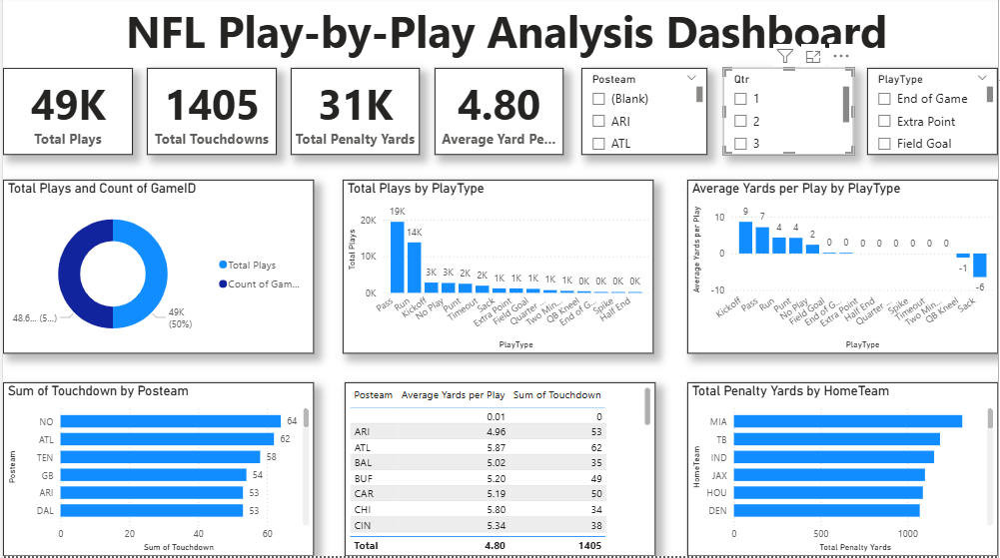

# NFL Play-by-Play Analysis Dashboard
## Project Overview

This project provides an exploratory data analysis (EDA) of NFL play-by-play data, using Power BI to design an interactive dashboard. The dashboard highlights key performance metrics such as total plays, touchdowns, penalties, and average yards per play, while also breaking down insights by team, play type, and game dynamics.

The goal is to help analysts, coaches, and fans better understand performance trends, efficiency, and penalty impacts in NFL games.

## Dataset

Source: [Project 2.xlsx / Project 2.csv] (provided in repo)

Content: NFL play-by-play records, including:

GameID – Unique game identifier

PlayType – Type of play (Run, Pass, Punt, Kickoff, etc.)

Posteam – Offensive team

HomeTeam – Home team identifier

PenaltyYards – Penalty yards per play

Yards – Yards gained/lost in a play

Touchdown – Indicator if play resulted in a touchdown

## Dashboard Features
## Key Metrics

49K+ Total Plays analyzed

1405 Touchdowns recorded

31K Penalty Yards tracked

4.8 Average Yards per Play

## Visual Insights

Play Distribution – Bar chart showing total plays by play type

Efficiency Analysis – Average yards per play by play type

Team Insights –

Touchdowns scored by posteam

Penalty yards by home team

Game Overview – Donut chart summarizing plays and game counts

## Filters for Interactivity

Quarter Selector – View plays by game quarter

Team Selector – Compare performances by specific teams

Play Type Filter – Focus on selected play categories

## Dashboard Preview

🛠 Tools & Technologies

Power BI – Data visualization & dashboard design

Excel / CSV – Data cleaning and preprocessing

Python (optional) – For exploratory data analysis before visualization

## How to Use

Clone this repository

git clone https://github.com/yourusername/nfl-play-analysis.git
cd nfl-play-analysis

Open the dataset (Project 2.xlsx) in Power BI Desktop

Load the provided PBIX file (if included)

Interact with filters and visuals to explore insights

## Future Improvements

Add predictive modeling for touchdown probability

Include advanced player-level metrics

Automate dataset updates with Python + API integration

## Author

## Alexander Chiamaka – Data Analyst | Power BI Developer

📧 Contact: alexanderchiamaka303@gmail.com
